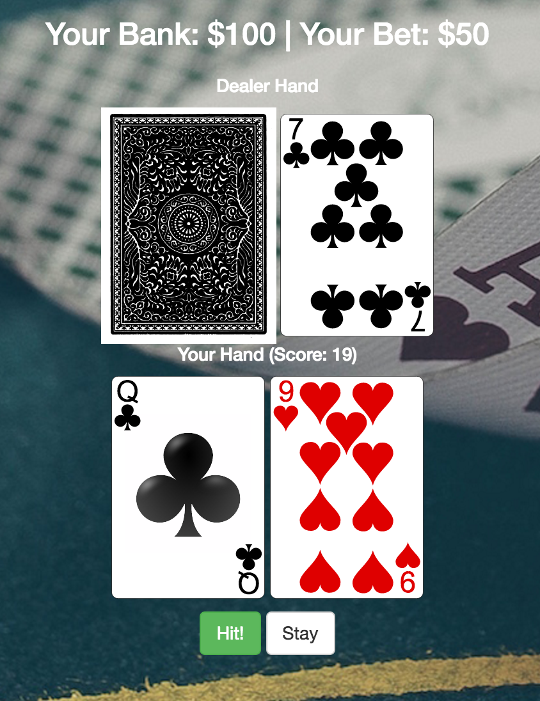

# ♣️ [Blackjack By Hannah](http://blackjackbyhannah.herokuapp.com/)

 In this simple but elegant blackjack app, you can wager your bets and try to beat the odds! Blackjack by Hannah is built on Sinatra and was built in the style of clean, modular, object oriented programming.

[Check it out!](https://mysterious-hollows-19482.herokuapp.com)

# Preview

## 1. Enter Your Bet

## 2. Hit or Stay

## 3. Play Out Hand

## Built With

* Sublime
* Ruby
* Sinatra

## Acknowledgments
Thanks to [Viking Code School](https://github.com/vikingeducation) for creating this assignment.

### Get in touch if you are having any issues!